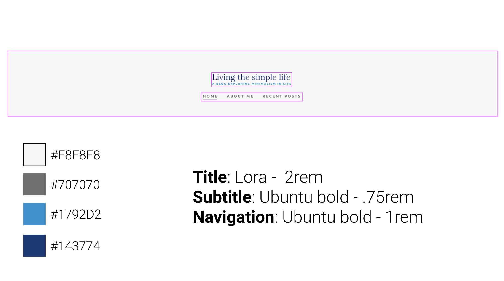
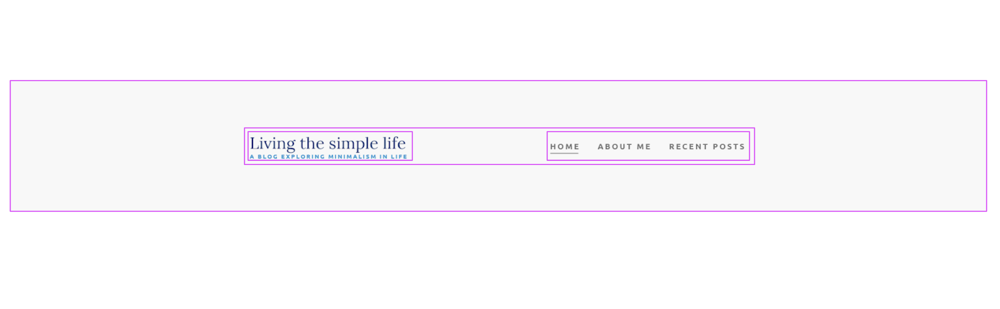
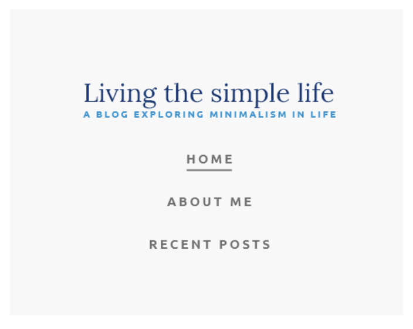
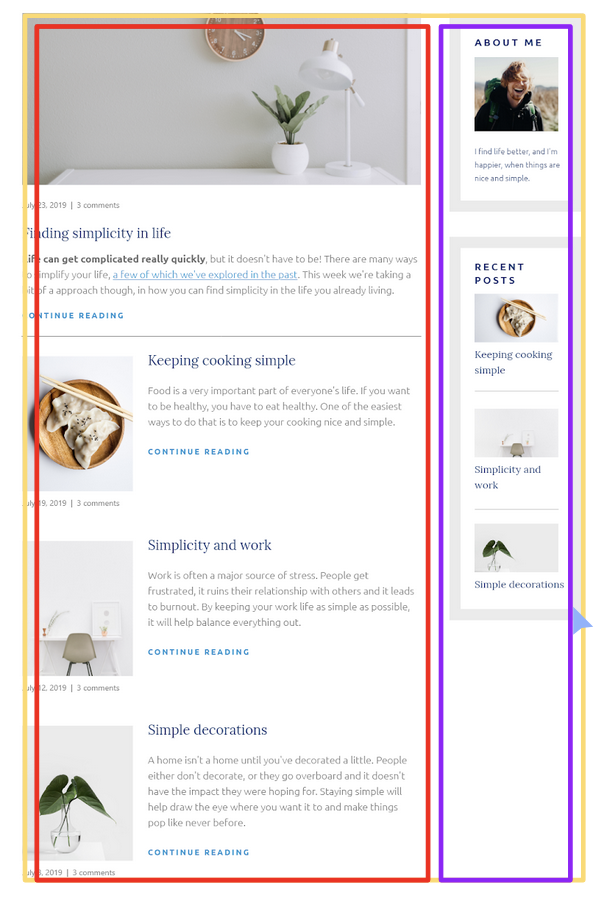
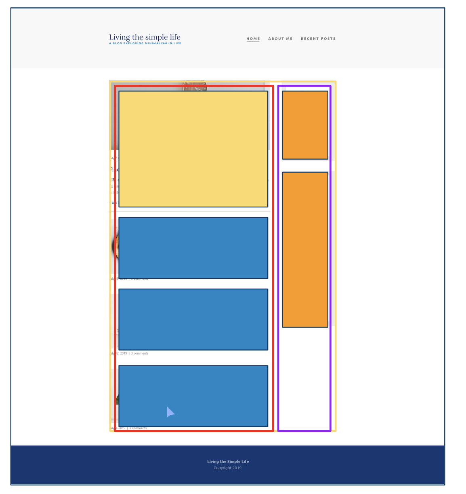

# Concepts I've learned in this project

- Flexbox
    - distributing the space with the `justify-content` and `align-items` properties
    - switching the main axis with the `flex-direction` property
    - ordering items in a flex container with the `order` property
- Media queries (switching the layout in different screens)

- Building a navigation
    - Centered version
    
    - Space-between version
    
    - Mobile version
    

- Setting up structure of a page
    - Identifying the layout (a container, a main section and a sidebar)
    

    - Identifying the parts of the page that need different classes (different styling)
    
- Cropping images with the `object-fit` property